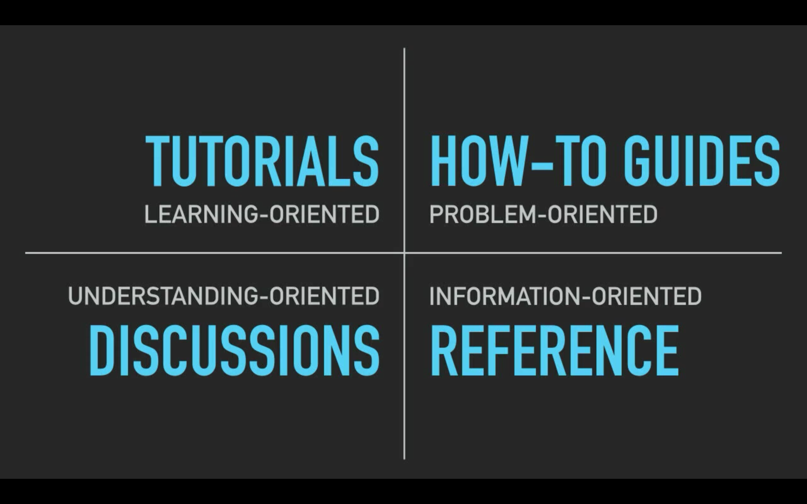

```{r setup, include=FALSE}
knitr::opts_chunk$set(echo = TRUE, eval=FALSE, warnings = FALSE, message = FALSE)
```

```{r}
library(ozbabynames)
library(tidyverse)
library(ggeasy)
```

# Problem: create a plot with text labels 
```{r}
ozbabynames

mydat <- ozbabynames %>%
  filter(year == 2017 & 
           state == "New South Wales" & 
           count > 300)

ggplot(mydat, aes(x=name, y=count)) +
  geom_jitter() +
  facet_wrap(~sex) +
  theme_bw()

# your turn!

# add labels to ggplot
# geom_text() or geom_label()

ggplot(mydat, aes(x=name, y=count)) +
  geom_jitter() +
  geom_text(label = mydat$name, check_overlap = TRUE) +
  facet_wrap(~sex) +
  theme_bw()
  
ggplot(mydat, aes(x=name, y=count)) +
  geom_label(label = mydat$name) + 
  facet_wrap(~sex) +
  theme_bw()


ggplot(mydat, aes(x=name, y=count, color = sex)) +
  geom_jitter(position = position_jitter(seed = 1)) +
  geom_text(label = mydat$name, check_overlap = TRUE,
            position = position_jitter(seed = 1)) +
  facet_wrap(~sex) +
  theme_bw() +
  easy_remove_x_axis() +
  easy_remove_legend()

# x reorder variable

# ggplot x reorder
mydat <- ozbabynames %>%
  filter(year == 2017 & 
           state == "New South Wales" & 
           count > 300) %>%
  mutate(name_popular = fct_reorder(name, count))

ggplot(mydat, aes(x=name_popular, y=count, color = sex)) +
  geom_jitter(position = position_jitter(seed = 1)) +
  geom_text(label = mydat$name, check_overlap = TRUE,
            position = position_jitter(seed = 1)) +
  facet_wrap(~sex) +
  theme_bw() +
  easy_remove_x_axis() +
  easy_remove_legend()

# remove geom text overlap
library(ggrepel)
ggplot(mydat, aes(x=name_popular, y=count, color = sex)) +
  geom_jitter(position = position_jitter(seed = 1)) +
  geom_text_repel(label = mydat$name,
            position = position_jitter(seed = 1)) +
  facet_wrap(~sex) +
  theme_bw() +
  easy_remove_x_axis() +
  easy_remove_legend()

ggplot(mydat, aes(x=name_popular, y=count, color = sex)) +
  geom_jitter(position = position_jitter(seed = 1)) +
  geom_label_repel(label = mydat$name,
            position = position_jitter(seed = 1)) +
  facet_wrap(~sex) +
  theme_bw() +
  easy_remove_x_axis() +
  easy_remove_legend()


```

## goal: add text labels to the plot, so each point is a name rather than a point or in addition to the point

# Errors installing new package...what do you do when you encounter errors?

[installing packages blog](https://www.littlemissdata.com/blog/r-package-install)
```{r}
library(installr)
uninstall.packages("ozbabynames")
install.packages("ozbabynames") 
## package ‘ozbabynames’ is not available (for R version 4.0.1)
## what to do now??
# google...
# is the package available in CRAN? ..no
# locate the package repo and install via devtools

# There is an install_github function to install R packages hosted on GitHub in the devtools package. But it requests developer’s name.

# install_github("DeveloperName/PackageName")
install_github("ropenscilabs/ozbabynames")
# cannot cannot find function install_github - need to load devtools

# 1) library(devtools)
# 2) devtools::install_github()

install_github("ropenscilabs/ozbabynames")
library(ozbabynames)
ozbabynames


uninstall.packages("emo")
install.packages("emo")
devtools::install_github("hadley/emo")
library(emo)
emo::ji("smile")

```

# Learning Something New

## R documentation
## Cheatsheets

- [ggplot2 cheatsheet](https://www.rstudio.com/wp-content/uploads/2015/03/ggplot2-cheatsheet.pdf)
- [rmarkdown cheatsheet](https://www.rstudio.com/wp-content/uploads/2015/02/rmarkdown-cheatsheet.pdf)

## tutorials

- [r4ds](https://r4ds.had.co.nz/)
- [RYouWithMe](https://rladiessydney.org/courses/ryouwithme/)

## blog posts 

- [Alison Hill Blogdown Blog](https://alison.rbind.io/post/2017-06-12-up-and-running-with-blogdown/)
- [purrr](http://www.rebeccabarter.com/blog/2019-08-19_purrr/)

# How to choose where to start???



- if you're just looking to new things in general then tutorials are a great option because they'll cover a range of topics
- however, if you have a specific problem then blog posts are often a better place to start because they will walk you through how to use a given package
- tip from Jenny R: when she is trying to learn something new, she'll Google "how to do X in R blog"
- if you've used a package before, but can't remember the arguments or just want to see one quick example then start with the R documentation (often there will be examples at the bottom of the documentation)

# knit R

- everything has to be loaded locally in the current file you are trying to knit
- if you have a variable saved in your global environment, it will work if you run it in R but it won't knit unless you've also created the variable within the file
- ...unless you do eval=FALSE, but then you'll only see the code not the results because it's not evaluating it
