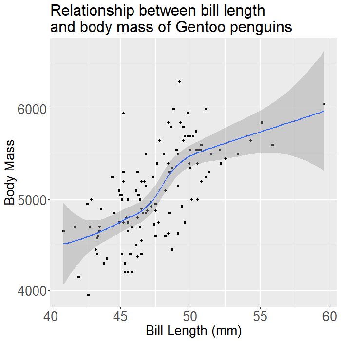
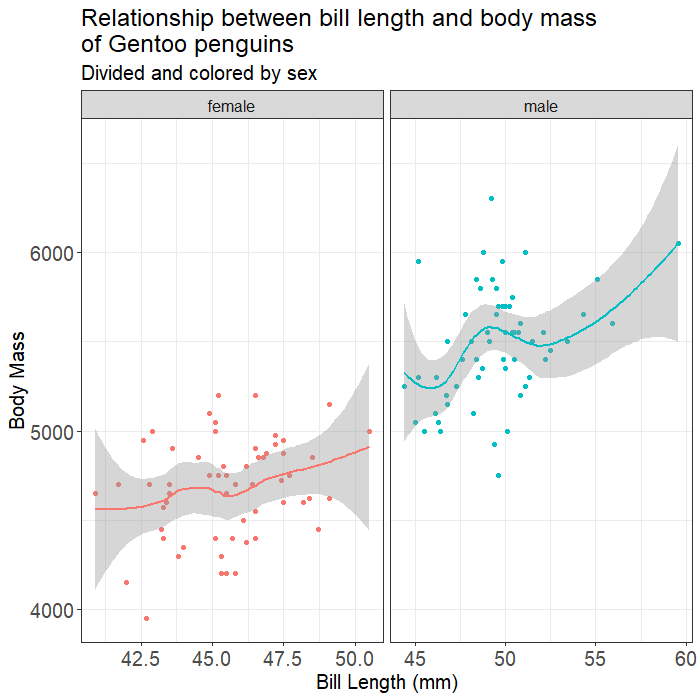
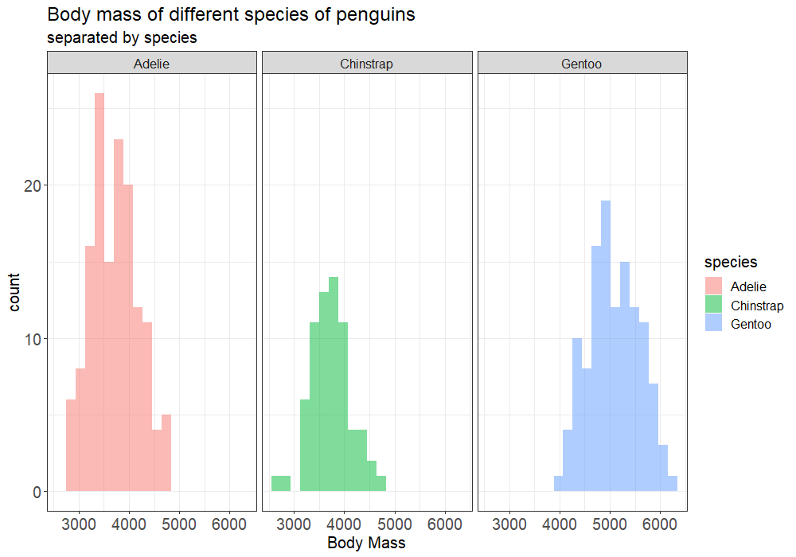

```{r warning=FALSE, message=FALSE}
library(tidyverse)
library(palmerpenguins)
library(here)
library(janitor)
```

- cheatsheet [google doc](https://docs.google.com/document/d/1zEP36GwV3XfPI3FB9b64ckRLkZTkYs27jX7eBzFHvNQ/edit?usp=sharing) (feel free to add to this!)

## Working Directory
  - what is a working directory? `getwd()`
  - how do you set it? `setwd()` or session &rarr; set working directory OR use an **R Project**
  - what is an R Project? 
  - I **always** use R projects to keep everything organized 
  - in order to read in a file, it must be located within your current working directory or you will have to explicitly tell R how to navigate to the correct location
  - Jenny's [blog on the here package](http://jenrichmond.rbind.io/post/how-to-use-the-here-package/) 
```{r warning=FALSE, message=FALSE}
# read in forensic data - note the data file is in my wd
forensic <- read_csv("data_forensic.csv") # tibble "tidy dataframe"
# forensic <- read.csv("data_forensic.csv") # this also works, but reads in your data as a dataframe instead of a tibble
```

## Tidyverse 
  - what is tidyverse?
  - tibbles vs dataframes
```{r}
# iris vs penguins data

# iris = dataframe
# penguins = tibble 

mydata <- iris %>%
  as_tibble() %>% # turns the dataframe into a tibble
  clean_names() %>% # cleans the variable names (gets rid of white space, capital letters, etc)
  rename(penguin_species = species, # rename specific columns
         s_length = sepal_length) # new name = old name

glimpse(mydata) # useful function to get a "glimpse" of your data and variable types

```

## Variable types
  - different types of variables (e.g dbl, int, fct, chr, lgl, date)
  - converting variable types
  - *factor variable trap: be careful converting a factor to numeric*
```{r}
# levels() will only work with factors
levels(penguins$species)
levels(penguins$sex)

penguins$species <- as.character(penguins$species) # convert numeric to character
penguins$bill_length_mm <- as.factor(penguins$bill_length_mm) # convert numeric to factor

# convert factor to numeric... this is the trap!!
penguins$bill_length_mm2 <- as.numeric(penguins$bill_length_mm) 
penguins$bill_length_mm3 <- as.numeric(as.character(penguins$bill_length_mm)) # make character first!
```

## Workflow Tips
  - when you're starting a new project, create an R project where you will keep all of your files
  - don't use white spaces when names files or variables (programming languages don't like white spaces)
  - every time you want to work on that project, you simply open up the .Rproj file and your working directory is automatically set
  - load libraries at the start of your document
  - read in your data
  - clean data names
  - glimpse() to see all variables and variable types 
  - are there any variables you need to convert to a different type?
  - *if you have an error in your code and you can't knit the file, what should you do?*
    - eval=FALSE
    
```{r eval=FALSE}
# if I run this line of code I get this: Error: 'a_anon.csv' does not exist in current working directory
# but I can still knit my markdown file by setting eval=FALSE in the chunk options
test <- read_csv("a_anon.csv")
```

```{r warning=FALSE, message=FALSE}
# to read this file, I had to tell R to go into my "brick" folder first
anon <- read_csv("brick/a_anon.csv")

# you can also use the here()
# both lines of code will do the same thing
anon <- read_csv(here("brick", "a_anon.csv"))
```
  
# ggplot challenge!!
   - can you recreate these plots using the palmerpenguins data?!
   
 <br>

 <br>

 <br>


