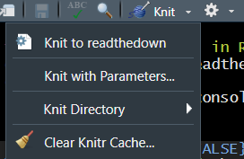
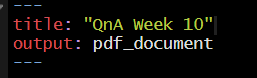
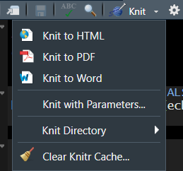

  
# Step by step instructions to allow you to knit to pdf/word

- Before installing anything, these are what my knit options look like <br><br>
 <br><br>
- If I click knit, it automatically knits to an html doc

### Step 1: install tinytex (you can just run this in your console as you'll only need to do this once)

```{r eval=FALSE}
tinytex::install_tinytex() 
```
  - [TinyTex info](https://yihui.org/tinytex/#:~:text=TinyTeX%20is%20a%20custom%20LaTeX,cases%2C%20especially%20for%20R%20users.&text=You%20only%20install%20LaTeX%20packages%20you%20actually%20need.)  
  - This will take several minutes 
  - Ignore the warning/error message, the installation should carry on even after the warning messages
  - Needs to go through and install 106 packages 
  - When it's complete, you will see a message that says “Please quit and reopen your R session and IDE (if you are using one, such as RStudio or Emacs) and check if tinytex:::is_tinytex() is TRUE.”

### Step 2: quit and reopen R

### Step 3: type tinytex:::is_tinytex() in your console and make sure it returns TRUE

### Step 4: edit the heading section to `output: pdf_document` 
 <br><br>

### Step 5: click the knit button 
  
  - This should hopefully work!

### Step 6: Now go back to the knit options and see if you have the HTML, PDF, and Word options

- Test out if these buttons work (you shouldn’t have to change the output code because it will do it automatically if everything is set up and running properly)
- Note: you will probably lose the pretty formatting that you have been using for your html code, but I wouldn’t worry about that too much <br><br>
 <br><br>

### If you don't see the knit options, you can always manually change the output setting to one of the following:
```{r eval = FALSE}
output: html_document
output: pdf_document
output: word_document
```

### Step 7: If this doesn't still doesn't work, trying installing a TeX/LaTeX system on your computer and then go through these steps again

- windows: You can download [MiKTeX](https://miktex.org/download)
- mac: You can download [MacTeX](http://www.tug.org/mactex/)
- select option to always install missing packages 
- Restart Rstudio after this installation 

### Other things to check for:

-  Tools > Global Options > Sweave and check what's selected under "Typeset LaTeX into PDF using:" It should be either pdfLaTeX or XeLaTeX.
- check to see if you have a .tex file that was created at any point - if you do, try running this line of code

```{r eval = FALSE}
tinytex::pdflatex('xxxx.tex')
```
